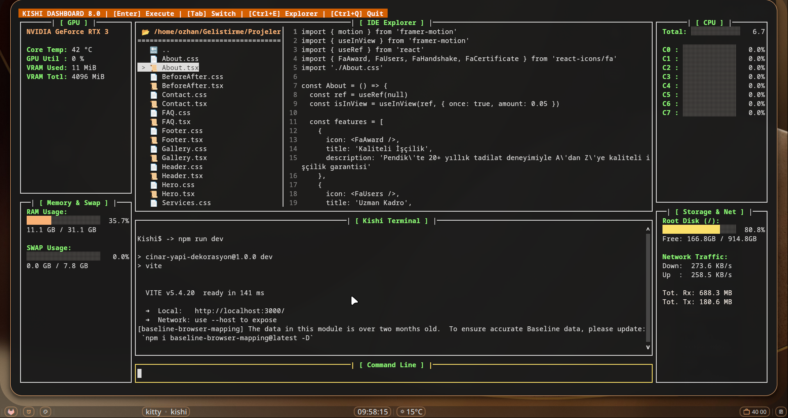
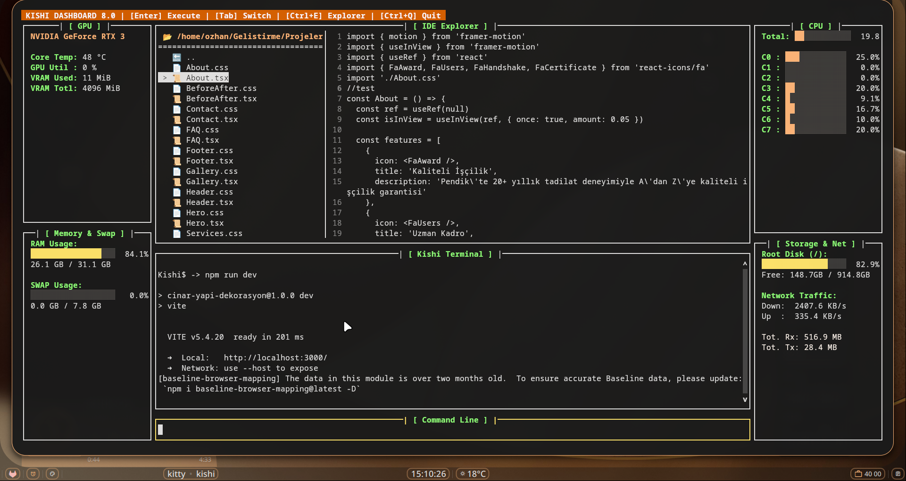
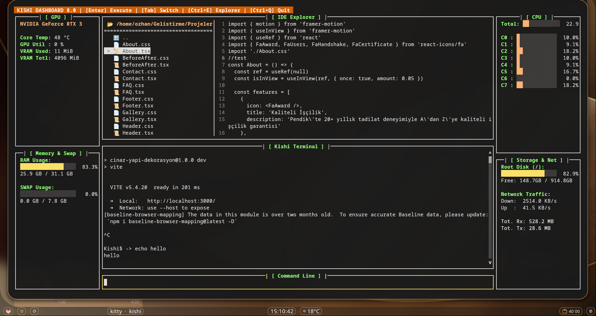
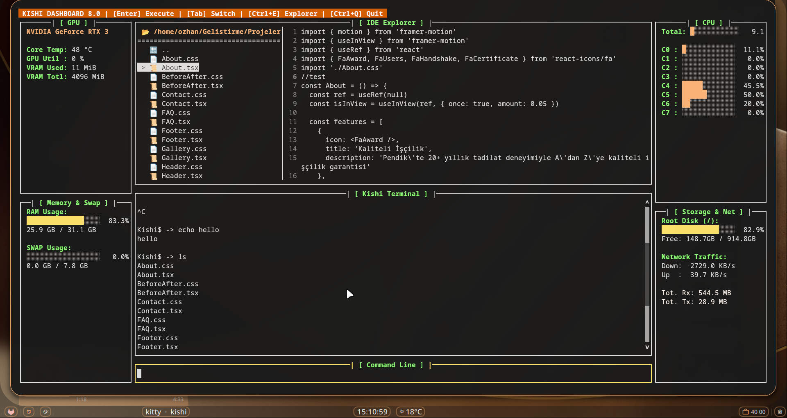
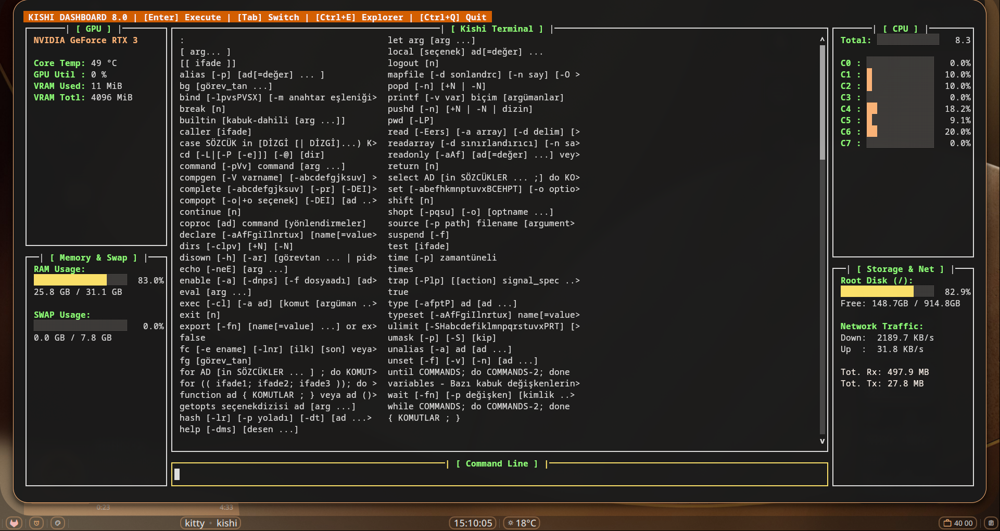
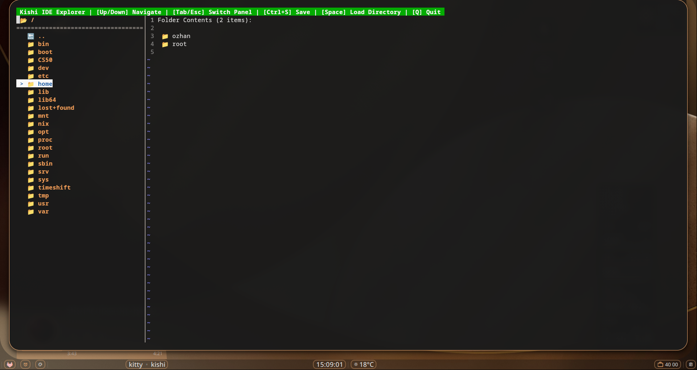
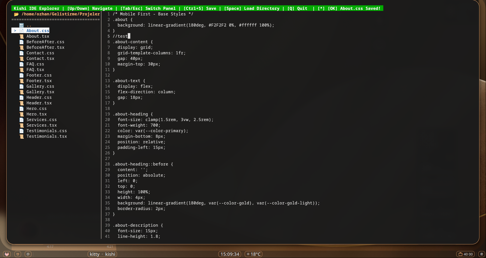
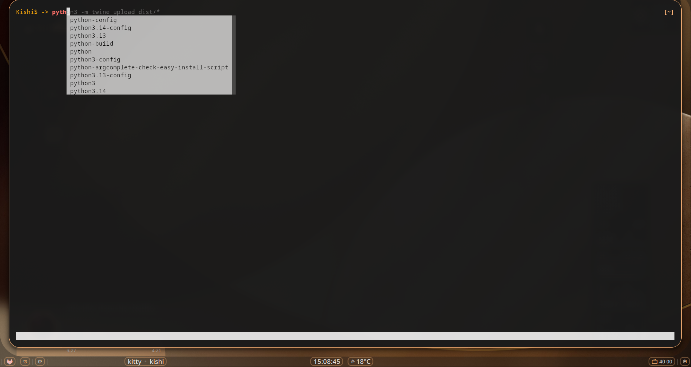
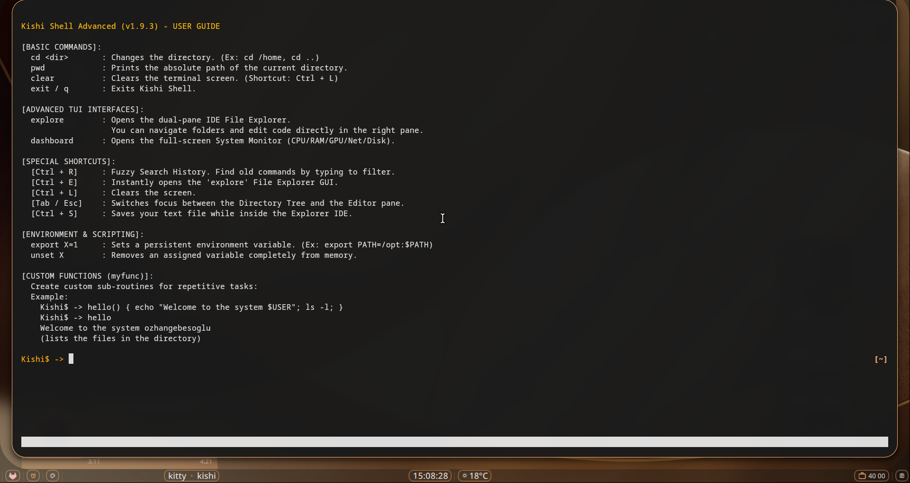
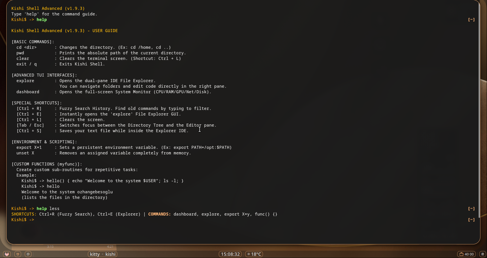

#  Kishi Shell (v2.0.0.1)

[](https://github.com/ozhangebesoglu/Kishi-Shell/actions/workflows/ci.yml)

> **If you like this project, please give it a ⭐ star on [GitHub](https://github.com/ozhangebesoglu/Kishi-Shell) and vote on [AUR](https://aur.archlinux.org/packages/kishi-shell)! Your support helps the project grow.**

[](https://asciinema.org/a/LQ7jQXtlGHgNoEVa)

Kishi Shell is a next-generation command line developed 100% in Python that transforms into a full-fledged **Terminal User Interface (TUI) Operating System** without requiring any external software (Go, C) or plugins. It combines the traditional Bash command set with modern *IDE (Code Editor)* and *System Monitor* features.

##  Installation & Running

### Option 1: Install via AUR (Arch Linux) — Recommended
```bash
yay -S kishi-shell
```

### Option 2: Install from Source
```bash
git clone https://github.com/ozhangebesoglu/Kishi-Shell.git
cd Kishi-Shell
chmod +x install.sh
./install.sh
```
The installer will try `pip3 install .` first. If your system uses PEP 668 protection, it will offer you to create a **virtual environment** (recommended) or use `--break-system-packages`.

### Option 3: Install via pip (PyPI)
```bash
pip install --upgrade kishi-shell
```

Type `kishi` in your terminal to launch Kishi Shell. Type `exit` to return to your default shell.

---

##  How the Installer Works

### Linux (`install.sh`)
The installer automatically detects your distro (Arch, Fedora, Debian/Ubuntu, openSUSE, Void, etc.) and:
1. Installs system dependencies (`python3`, `pip`, `prompt_toolkit`, `psutil`) via your package manager
2. Runs `pip3 install .` — if PEP 668 protection blocks it, you can choose between `--break-system-packages` or a virtual environment (`~/.kishi-venv`)
3. Verifies the `kishi` command is available in your PATH

### Windows (`install.bat`)
1. Runs `pip install .` (tries `pip`, `python -m pip`, `python3 -m pip`)
2. Auto-detects the Python Scripts directory and adds it to your user PATH
3. You can always run with `python -m kishi` as a fallback

---

##  Using Kishi as Your Login Shell (Optional)

> **Note:** Kishi works perfectly as a regular shell — just type `kishi` to launch it. Setting it as a login shell is entirely optional and only needed if you want Kishi to be your default system shell.

If you want to set Kishi as your login shell:

```bash
# 1. Register kishi as an allowed shell
kishi --setup
# or manually:
echo $(which kishi) | sudo tee -a /etc/shells

# 2. Set as your default login shell
chsh -s $(which kishi)

# To revert back to bash at any time:
chsh -s /bin/bash
```

**Safety Features:**
- **Fallback protection:** If Kishi crashes on startup, it automatically falls back to `/bin/bash` or `/bin/sh` — your system will never be locked out
- **Profile sourcing:** Automatically sources `/etc/profile` and `~/.profile` (or `~/.bash_profile`) so your environment is properly set up
- **Display manager compatible:** Properly handles `kishi -c "exec gnome-session"` for GDM, SDDM, LightDM
- **Non-interactive mode:** Pipes (`echo "echo hello" | kishi`) and scripts work without blocking

**Invocation Modes:**
```bash
kishi                              # Interactive mode (prompt + UI)
kishi -c "ls -la"                  # Execute a single command and exit
kishi --login                      # Login shell mode (source profiles)
kishi -l -c "exec gnome-session"   # Login + command (used by display managers)
echo "echo hello" | kishi          # Pipe mode (non-interactive, no banner)
```

---

##  Advanced Visual Interfaces (TUI)
Kishi Shell doesn't make you install Midnight Commander or `top`/`htop`. It has its own zero-latency tools rendered 100% in Python.

### 1-) VSCode-like Unified IDE & Dashboard
No more reading files on a plain black screen! Kishi Shell doesn't make you install Midnight Commander or `top`/`htop`. It merges both into a perfect VSCode-like layout.
- **Command:** `dashboard`
Running isolated in the background, this system displays CPU Core Usage, RAM / SWAP Metrics, Root Disk space, and Live Network Traffic (Down/Up) in side panels. 



- When you press **`Ctrl + E`**, the massive terminal in the center instantly transforms into a **Dual-Panel IDE (Development Environment)**. The screen splits from the top into two sections, placing the Folder Tree on the left and the Code Editor on the right. The bottom section remains as the Kishi Terminal.
- You can navigate between panels using the **`Tab`** key, creating a perfect cycle between Tree -> Editor -> Terminal -> Input Line.
- Write your code and save it instantly with **`Ctrl + S`**. 



#### Dashboard Keyboard Shortcuts

| Shortcut | Action |
|----------|--------|
| `Enter` | Execute command |
| `Tab` | Auto-complete commands and paths |
| `Ctrl + E` | Toggle IDE Explorer (file tree + editor) |
| `Shift + Tab` | Cycle focus between panels |
| `Ctrl + R` | Fuzzy search command history |
| `Ctrl + C` | Send SIGINT to running process |
| `Ctrl + Q` | Quit dashboard |
| `PgUp / PgDn` | Scroll terminal output |
| `Home / End` | Jump to top / bottom of output |

### 2-) Interactive Terminal & Directory Synchronization
The Kishi Terminal at the bottom of the screen works in live sync with the Folder Tree! 
- When you type `cd` in the command line to change directories, the Tree updates automatically.
- When you run long-running Python or Bash scripts that wait for your input (like `input()`), the interface never freezes! Thanks to background binary streaming, command outputs are printed directly to the interface, and inputs you type in the command line at the bottom are forwarded directly to the code's `stdin` input.
- You can send **`Ctrl + C`** to kill a running process without closing the dashboard, then continue using the terminal normally.
- Programs that require a terminal (`python`, `node`, `java`) work properly thanks to full pseudo-terminal (PTY) support.





### 3-) Standalone File Explorer
The IDE Explorer also works as a standalone dual-pane file browser outside the dashboard. Navigate your entire filesystem, preview directories, and edit code with line numbers.
- **Command:** `explore`
- **Shortcut:** **`Ctrl + E`**



### 4-) Tab Completion & Syntax Highlighting
Kishi provides real-time tab completion for system commands, builtins, and filesystem paths. Known commands appear in green, unknown ones in red.


### 5-) Help System & History Search (Fuzzy Search)
- For Comprehensive Help: `help` — For Quick Shortcuts: `help less`



No need to install external FZF to find your old commands.
- **Shortcut:** **`Ctrl + R`**
As you type like a typewriter, it performs character matching among thousands of your old commands and brings the desired command to your screen in seconds. Press `Enter` to pull the command.

---

##  Plugin Marketplace
Kishi Shell features a dynamic, Python-powered plugin ecosystem. You can browse, install, and manage official extensions natively without leaving the terminal or reloading the environment.

### Plugin Commands

| Command | Description |
|---------|-------------|
| `plugin list` | List all installed plugins |
| `plugin market` | Browse available plugins in the marketplace |
| `plugin install <name>` | Install a plugin by name from the marketplace |
| `plugin install <url>` | Install a plugin from a direct GitHub raw URL |
| `plugin remove <name>` | Uninstall a plugin |

### Available Plugins

| Plugin | Command | Description | Usage |
|--------|---------|-------------|-------|
| **weather** | `weather` | Live weather from [wttr.in](https://wttr.in) | `weather` (auto-detect location) or `weather Istanbul` |
| **ip** | `ip` | Public IP & location info via [ipinfo.io](https://ipinfo.io) | `ip` |
| **qr** | `qr` | Generate ASCII QR codes in your terminal | `qr https://github.com` or `qr "Hello World"` |
| **hello** | `hello` | Demo plugin — test your marketplace connection | `hello` |

### Example Usage

```bash
# Browse the marketplace
Kishi$ -> plugin market
 Available Plugins in Kishi Marketplace:
  - hello.py
  - weather.py
  - ip.py
  - qr.py

# Install a plugin
Kishi$ -> plugin install weather
[*] Downloading 'weather.py' from marketplace...
[+] Plugin 'weather' installed successfully!

# Use it immediately — no restart needed
Kishi$ -> weather Istanbul
Istanbul: ⛅️ +18°C

# Check what you have installed
Kishi$ -> plugin list
 Installed Plugins:
  - weather

# Remove when you no longer need it
Kishi$ -> plugin remove weather
[+] Plugin 'weather' removed.
```

Once installed, plugins operate at native speed and are fully integrated into Kishi's event loop. Plugins are stored in `~/.kishi/plugins/` and loaded automatically on shell startup.

### Creating Your Own Plugin

Create a `.py` file where the **filename must exactly match** the command name it exports:

```python
# mycommand.py
def mycommand(args):
    """args[0] = command name, args[1:] = user arguments"""
    if len(args) < 2:
        print("Usage: mycommand <text>")
        return 1

    print(f"Hello, {args[1]}!")
    return 0  # exit code: 0 = success

PLUGIN_COMMANDS = {
    "mycommand": mycommand  # key MUST match filename (mycommand.py -> "mycommand")
}
```

Install from any source:
```bash
# From the official marketplace (submit a PR to Kishi-Plugins repo)
plugin install mycommand

# Or from any raw GitHub URL
plugin install https://raw.githubusercontent.com/user/repo/main/mycommand.py
```

For more details, see the [Kishi-Plugins](https://github.com/ozhangebesoglu/Kishi-Plugins) repository.

---

##  Scripting and Environment Variables

### Setting and Reading Variables (`export`)
You can define new variables in the Kishi environment that other programs can also read.
```bash
Kishi$ -> export MY_KEY="12345"
Kishi$ -> echo $MY_KEY
12345
```
Simply type `unset MY_KEY` to remove it. You can list all loaded variables in the environment by just typing `export`.

### Create Your Own Commands (`myfunc`)
If you keep repeating a task, you can instantly teach Kishi code blocks (Sub-Routines). Defining functions is very easy:

```bash
Kishi$ -> greet() { echo "Welcome to the System $USER"; ls -l; }
Kishi$ -> greet
Welcome to the System ozhangebesoglu
drwxrwxr-x 2 user user 4096 ...
```
You can chain functions with semicolons (`;`) and run massive automation scripts in a single line. Moreover, you can squeeze complex Shell operators like `|`, `&&`, `>`, `>>` in between your commands and outputs!

---

##  Architecture

Kishi is built on a classic **compiler pipeline** following SOLID principles:

```
Input → Lexer → Parser → Expander → Executor
         │        │         │          │
      tokens     AST    expanded    fork/exec
                          args      pipelines
```

| Module | Responsibility |
|--------|---------------|
| `lexer.py` | Tokenization, quote tracking |
| `parser.py` | Recursive descent parser, AST generation |
| `expander.py` | `$VAR`, glob, tilde, `$(cmd)` expansion |
| `executor.py` | fork/exec, pipelines, redirections, job control |
| `builtins.py` | 26 built-in commands |
| `tui_dashboard.py` | VS Code-style dashboard (5 SOLID classes) |
| `tui_explorer.py` | Dual-pane IDE explorer |
| `tui_fuzzy.py` | Ctrl+R fuzzy search engine |
| `ui.py` | Syntax highlighting, completions, keybindings |
| `main.py` | Login shell, mode detection, profile sourcing |

---

##  Help Center (`help`)
Kishi always assists you. If you want to remember all system features and command tips:
- For Comprehensive (Full) Help: `help`
- For Quick Shortcut Summaries: `help less`
is all you need to type.

---

## Contributing

We welcome contributions! Check out [CONTRIBUTING.md](CONTRIBUTING.md) for guidelines on how to get started.

---
**Developed by:** Ozhan Gebesoglu  
*Designed to push the limits of Python in the Terminal.*

## Star History

[](https://star-history.com/#ozhangebesoglu/Kishi-Shell&Date)
