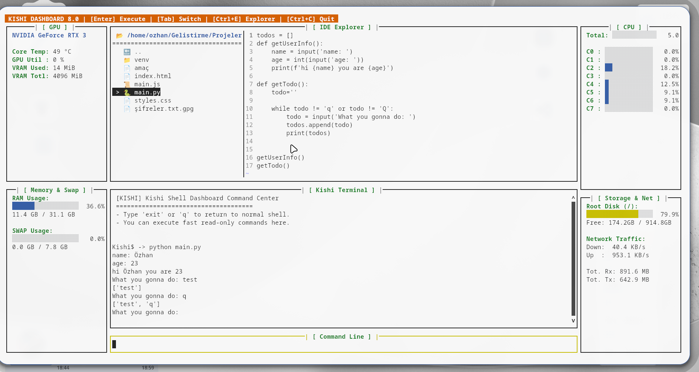
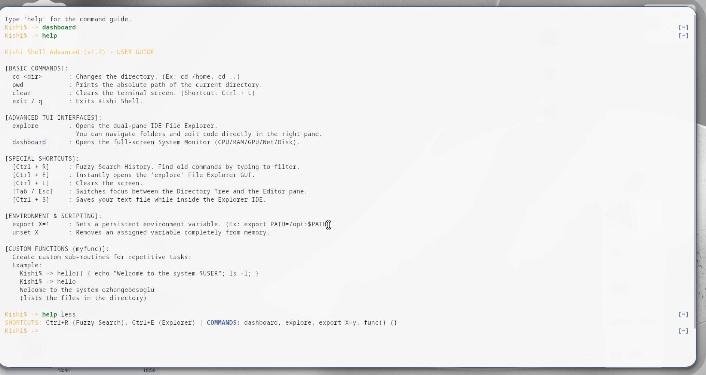
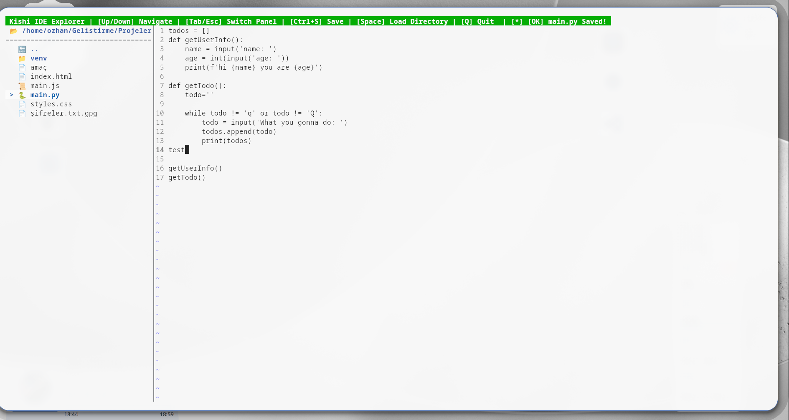

#  Kishi Shell (v1.9.2)

Kishi Shell, %100 Python ile geliştirilmiş, harici yazılım (Go, C) veya eklenti gerektirmeden tam teşekküllü bir **Terminal İşletim Sistemi Arayüzüne (TUI)** dönüşen yeni nesil komut satırıdır. Geleneksel Bash komut setini modern *IDE (Kod Editörü)* ve *Sistem Monitörü* özellikleriyle birleştirir.

##  Kurulum & Çalıştırma

### Seçenek 1: Kaynaktan Kurulum
```bash
git clone https://github.com/ozhangebesoglu/Kishi-Shell.git
cd Kishi-Shell
chmod +x install.sh
./install.sh
```
Yükleyici önce `pip3 install .` deneyecektir. Sisteminiz PEP 668 koruması kullanıyorsa, size **sanal ortam** (önerilen) veya `--break-system-packages` seçeneği sunacaktır.

### Seçenek 2: pip ile Kurulum (PyPI)
```bash
pip install --upgrade kishi-shell
```

Terminale `kishi` yazarak Kishi Shell'i başlatabilirsiniz. Çıkmak için `exit` yazmanız yeterlidir.

---

##  İleri Düzey Görsel Arayüzler (TUI)
Kishi Shell size Midnight Commander veya `top`/`htop` indirtmez. Kendi içerisinde %100 Python ile renderladığı sıfır-gecikmeli araçlara sahiptir.

### 1-) VSCode-like Unified IDE & Dashboard
Dümdüz kara ekranda dosya okumaya son! Kishi Shell size Midnight Commander veya `top`/`htop` indirtmez. İkisini mükemmel bir VSCode düzeninde birleştirir.
- **Komut:** `dashboard`
Arka planda izole olarak çalışan bu sistem; CPU Çekirdek Kullanımını, RAM / SWAP Metriklerini, Root Disk alanını ve Canlı Ağ Trafiğini (Down/Up) yan panellerde gösterir. 


- **`Ctrl + E`** tuşuna bastığınızda, ortadaki devasa terminal anında **Çift Panelli bir IDE'ye (Geliştirme Ortamı)** dönüşür. Ekran üst bölümden ikiye bölünerek Sol tarafa Klasör Ağacını (Tree), Sağ tarafa Kod Editörünü yerleştirir. Alt kısım Kishi Terminali olarak kalır.
- Paneller arası gezinmek için **`Tab`** tuşunu kullanarak Ağaç -> Editör -> Terminal -> Girdi Satırı arasında mükemmel bir döngü kurabilirsiniz.
- Kodunuzu yazar, **`Ctrl + S`** ile saniyede kaydedersiniz. 


### 2-) İnteraktif Terminal & Dizin Senkronizasyonu
Ekranın altındaki Kishi Terminali, Klasör Ağacıyla canlı senkronize çalışır! 
- Komut satırına `cd` yazıp klasör değiştirdiğinizde Ağaç da otomatik güncellenir.
- `input()` gibi sizden veri bekleyen uzun soluklu Python veya Bash scriptlerini çalıştırdığınızda arayüz asla donmaz! Arka plan ikili veri akışı (binary streaming) sayesinde komut çıkıntıları direkt arayüze basılır ve en alttaki komut satırından yazdığınız girdiler doğrudan kodun `stdin` girişine yönlendirilir.


### 3-) Tarihçe Arama (Fuzzy Search)
Eski komutlarınızı bulmak için harici FZF kurmanıza gerek yok.
- **Kısayol:** **`Ctrl + R`**
Daktilo gibi tuşlara bastıkça binlerce eski komutunuz arasından karakter eşleşmesi yaparak istediğiniz komutu saniyede ekranınıza getirir. `Enter`'a basıp komutu çekebilirsiniz.

---

##  Scripting ve Çevre Değişkenleri (Environment)

### Değişken Atamak ve Okumak (`export`)
Kishi ortamına diğer programların da okuyabilmesi için yeni değişkenler tanımlayabilirsiniz.
```bash
Kishi$ -> export MY_KEY="12345"
Kishi$ -> echo $MY_KEY
12345
```
Silmek için `unset MY_KEY` yazmanız yeterlidir. Ortamda yüklü tüm değişkenleri sadece `export` yazarak listeleyebilirsiniz.

### Kendi Komutlarınızı Üretin (`myfunc`)
Bir işi sürekli tekrar ediyorsanız Kishi'ye anında kod blokları (Sub-Routines) öğretebilirsiniz. Fonksiyon tanımlamak çok kolaydır:

```bash
Kishi$ -> merhaba() { echo "Sisteme Hosgeldiniz $USER"; ls -l; }
Kishi$ -> merhaba
Sisteme Hosgeldiniz ozhangebesoglu
drwxrwxr-x 2 user user 4096 ...
```
Fonksiyonları ard arda noktalı virgül (`;`) ile zincirleyebilir, tek satırda devasa otomasyon scriptleri çalıştırabilirsiniz. Dahası, komutlarınızın ve çıktılarınızın ortasına `|`, `&&`, `>`, `>>` gibi karmaşık Shell operatörleri de sıkıştırabilirsiniz!

---

##  Yardım Merkezi (`help`)
Kishi her zaman size asistanlık yapar. Sisteme ait tüm özellikleri ve komut ipuçlarını hatırlamak isterseniz:
- Kapsamlı (Tam) Yardım İçin: `help`
- Hızlıca Kısayol Özetleri İçin: `help less`
yazmanız yeterli olacaktır.

---
**Geliştiren:** Ozhan Gebesoglu  
*Python'un sınırlarını Terminal'de zorlamak için tasarlandı.*
