#  Kishi Shell (v2.0.2.0)

[](https://github.com/ozhangebesoglu/Kishi-Shell/actions/workflows/ci.yml)

> **Bu projeyi beğendiyseniz lütfen [GitHub](https://github.com/ozhangebesoglu/Kishi-Shell)'da ⭐ yıldız verin ve [AUR](https://aur.archlinux.org/packages/kishi-shell)'da oy kullanın! Desteğiniz projenin büyümesine yardımcı olur.**

[](https://asciinema.org/a/LQ7jQXtlGHgNoEVa)

Kishi Shell, %100 Python ile geliştirilmiş, harici yazılım (Go, C) veya eklenti gerektirmeden tam teşekküllü bir **Terminal İşletim Sistemi Arayüzüne (TUI)** dönüşen yeni nesil komut satırıdır. Geleneksel Bash komut setini modern *IDE (Kod Editörü)* ve *Sistem Monitörü* özellikleriyle birleştirir.

##  Kurulum & Çalıştırma

### Seçenek 1: AUR ile Kurulum (Arch Linux) — Önerilen
```bash
yay -S kishi-shell
```

### Seçenek 2: Kaynaktan Kurulum
```bash
git clone https://github.com/ozhangebesoglu/Kishi-Shell.git
cd Kishi-Shell
chmod +x install.sh
./install.sh
```
Yükleyici önce `pip3 install .` deneyecektir. Sisteminiz PEP 668 koruması kullanıyorsa, size **sanal ortam** (önerilen) veya `--break-system-packages` seçeneği sunacaktır.

### Seçenek 3: pip ile Kurulum (PyPI)
```bash
pip install --upgrade kishi-shell           # Sadece core shell (~30 KB)
pip install --upgrade "kishi-shell[krep]"   # + Krep AI LSA modeli için numpy/scipy
```

Temel kurulum size Kishi Shell + anahtar kelime tabanlı `krep` motorunu verir.
`[krep]` opsiyonel extra'sı sözlüksüz LSA modeli (`krep --learn PATH` vb.) için
`numpy + scipy` ekler. Çoğu shell kullanıcısı buna ihtiyaç duymaz.

Terminale `kishi` yazarak Kishi Shell'i başlatabilirsiniz. Çıkmak için `exit` yazmanız yeterlidir.

---

##  Yükleyici Nasıl Çalışır

### Linux (`install.sh`)
Yükleyici dağıtımınızı otomatik algılar (Arch, Fedora, Debian/Ubuntu, openSUSE, Void, vb.) ve:
1. Sistem bağımlılıklarını (`python3`, `pip`, `prompt_toolkit`, `psutil`) paket yöneticiniz ile kurar
2. `pip3 install .` çalıştırır — PEP 668 koruması engelliyor ise `--break-system-packages` veya sanal ortam (`~/.kishi-venv`) seçenekleri sunar
3. `kishi` komutunun PATH'inizde çalışır durumda olduğunu doğrular

### Windows (`install.bat`)
1. `pip install .` çalıştırır (`pip`, `python -m pip`, `python3 -m pip` sırasıyla dener)
2. Python Scripts dizinini otomatik algılayıp kullanıcı PATH'ine ekler
3. Her zaman `python -m kishi` ile de çalıştırabilirsiniz

---

##  Kishi'yi Login Shell Olarak Kullanma (İsteğe Bağlı)

> **Not:** Kishi normal bir shell olarak mükemmel çalışır — terminale `kishi` yazmanız yeterlidir. Login shell olarak ayarlamak tamamen isteğe bağlıdır ve sadece Kishi'yi varsayılan sistem shell'iniz yapmak isterseniz gereklidir.

Kishi'yi login shell olarak ayarlamak isterseniz:

```bash
# 1. Kishi'yi izin verilen shell'lere kaydet
kishi --setup
# veya manuel olarak:
echo $(which kishi) | sudo tee -a /etc/shells

# 2. Varsayılan shell olarak ayarla
chsh -s $(which kishi)

# İstediğiniz zaman bash'a geri dönebilirsiniz:
chsh -s /bin/bash
```

**Güvenlik Özellikleri:**
- **Fallback koruması:** Kishi başlangıçta çökerse otomatik olarak `/bin/bash` veya `/bin/sh`'a düşer — sisteminiz asla kilitlenmez
- **Profile sourcing:** Giriş yapıldığında `/etc/profile` ve `~/.profile` (veya `~/.bash_profile`) otomatik yüklenir
- **Masaüstü yöneticisi uyumlu:** GDM, SDDM, LightDM için `kishi -c "exec gnome-session"` düzgün çalışır
- **Non-interactive mod:** Pipe'lar (`echo "echo merhaba" | kishi`) ve scriptler takılmadan çalışır

**Çalıştırma Modları:**
```bash
kishi                              # İnteraktif mod (prompt + arayüz)
kishi -c "ls -la"                  # Tek komut çalıştır ve çık
kishi --login                      # Login shell modu (profilleri yükle)
kishi -l -c "exec gnome-session"   # Login + komut (masaüstü yöneticileri kullanır)
echo "echo merhaba" | kishi        # Pipe modu (non-interactive, banner yok)
```

---

##  İleri Düzey Görsel Arayüzler (TUI)
Kishi Shell size Midnight Commander veya `top`/`htop` indirtmez. Kendi içerisinde %100 Python ile renderladığı sıfır-gecikmeli araçlara sahiptir.

### 1-) VSCode-like Unified IDE & Dashboard
Dümdüz kara ekranda dosya okumaya son! Kishi Shell size Midnight Commander veya `top`/`htop` indirtmez. İkisini mükemmel bir VSCode düzeninde birleştirir.
- **Komut:** `dashboard`
Arka planda izole olarak çalışan bu sistem; CPU Çekirdek Kullanımını, RAM / SWAP Metriklerini, Root Disk alanını ve Canlı Ağ Trafiğini (Down/Up) yan panellerde gösterir. 
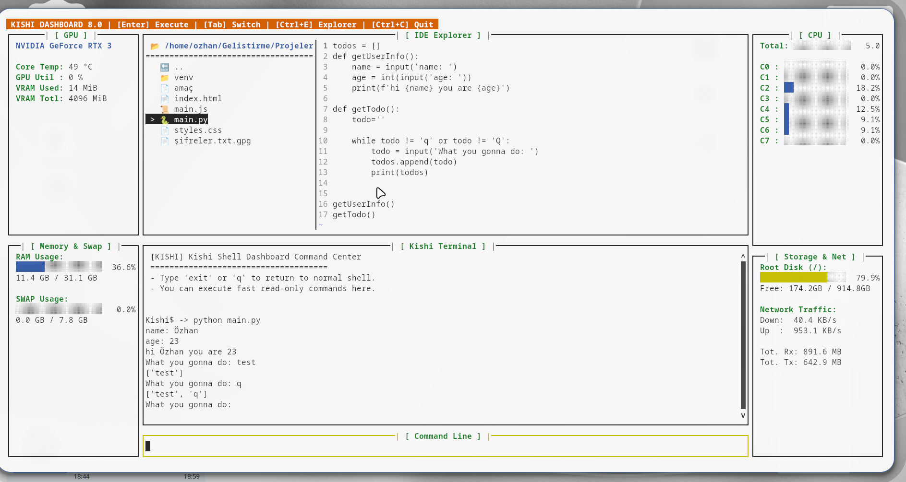
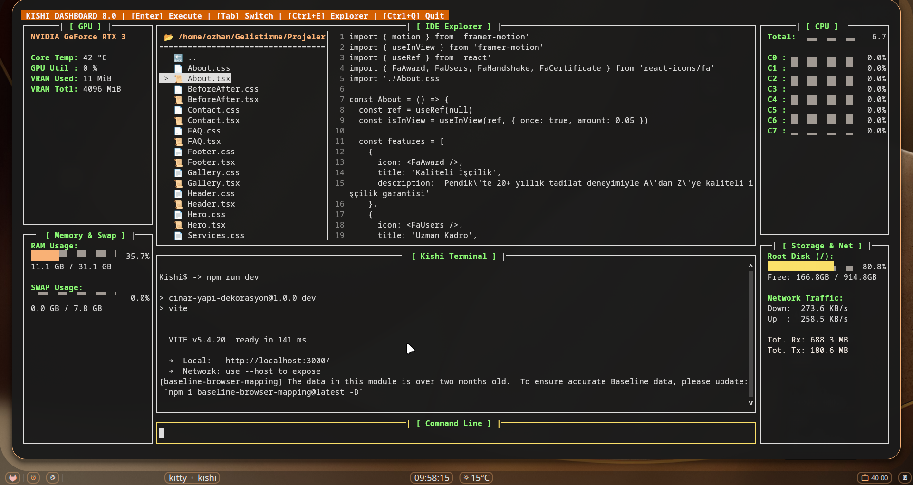

- **`Ctrl + E`** tuşuna bastığınızda, ortadaki devasa terminal anında **Çift Panelli bir IDE'ye (Geliştirme Ortamı)** dönüşür. Ekran üst bölümden ikiye bölünerek Sol tarafa Klasör Ağacını (Tree), Sağ tarafa Kod Editörünü yerleştirir. Alt kısım Kishi Terminali olarak kalır.
- Paneller arası gezinmek için **`Tab`** tuşunu kullanarak Ağaç -> Editör -> Terminal -> Girdi Satırı arasında mükemmel bir döngü kurabilirsiniz.
- Kodunuzu yazar, **`Ctrl + S`** ile saniyede kaydedersiniz. 
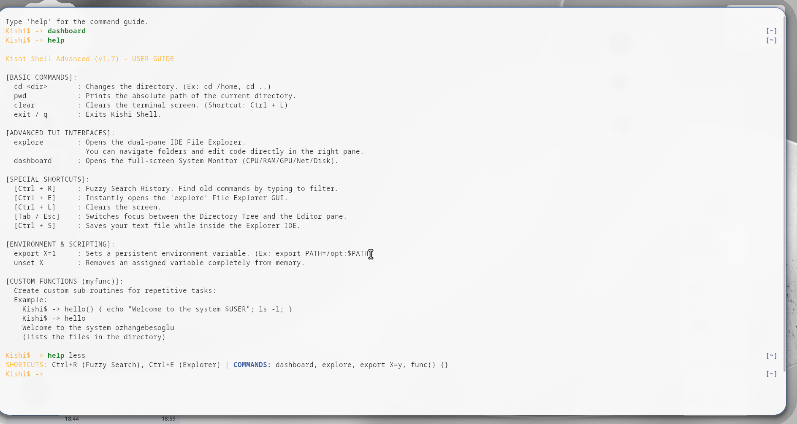
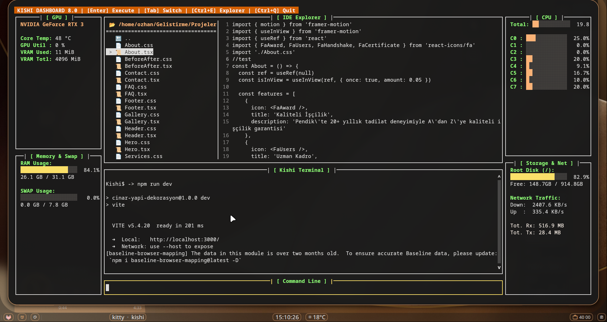

#### Dashboard Klavye Kısayolları

| Kısayol | İşlev |
|---------|-------|
| `Enter` | Komut çalıştır |
| `Tab` | Komut ve yol otomatik tamamlama |
| `Ctrl + E` | IDE Explorer'ı aç/kapat (dosya ağacı + editör) |
| `Shift + Tab` | Paneller arası geçiş |
| `Ctrl + R` | Komut geçmişinde fuzzy arama |
| `Ctrl + C` | Çalışan programa SIGINT gönder |
| `Ctrl + Q` | Dashboard'dan çık |
| `PgUp / PgDn` | Terminal çıktısını kaydır |
| `Home / End` | Çıktının başına / sonuna atla |

### 2-) İnteraktif Terminal & Dizin Senkronizasyonu
Ekranın altındaki Kishi Terminali, Klasör Ağacıyla canlı senkronize çalışır! 
- Komut satırına `cd` yazıp klasör değiştirdiğinizde Ağaç da otomatik güncellenir.
- `input()` gibi sizden veri bekleyen uzun soluklu Python veya Bash scriptlerini çalıştırdığınızda arayüz asla donmaz! Arka plan ikili veri akışı (binary streaming) sayesinde komut çıkıntıları direkt arayüze basılır ve en alttaki komut satırından yazdığınız girdiler doğrudan kodun `stdin` girişine yönlendirilir.
- **`Ctrl + C`** ile çalışan process'i dashboard'u kapatmadan öldürebilir, ardından terminali kullanmaya devam edebilirsiniz.
- Terminal gerektiren programlar (`python`, `node`, `java`) tam pseudo-terminal (PTY) desteği sayesinde düzgün çalışır.
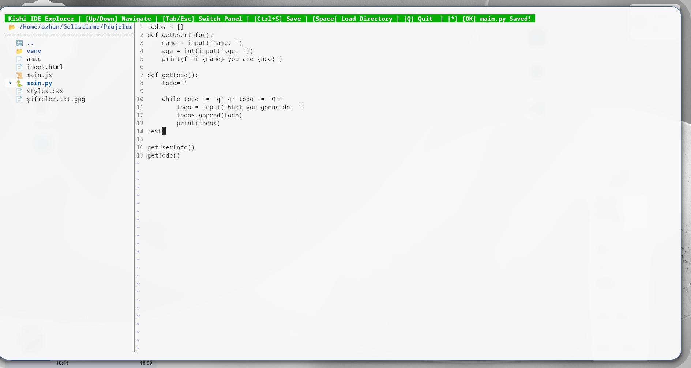
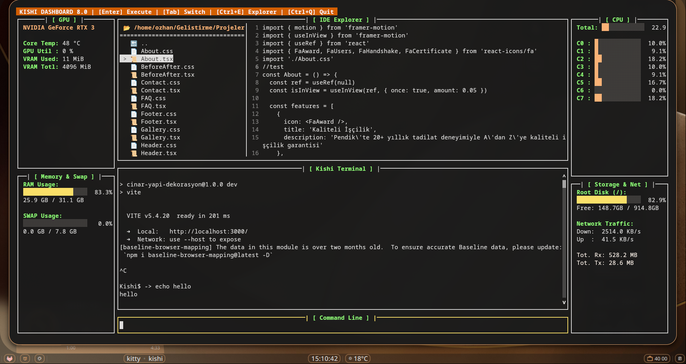
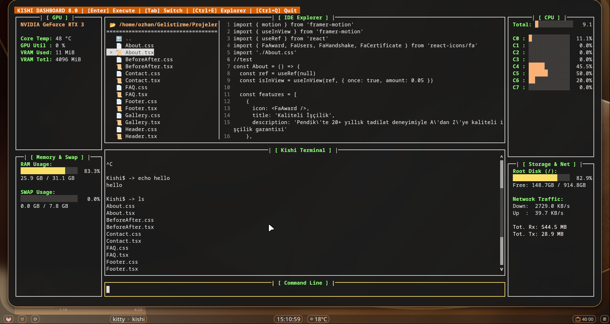
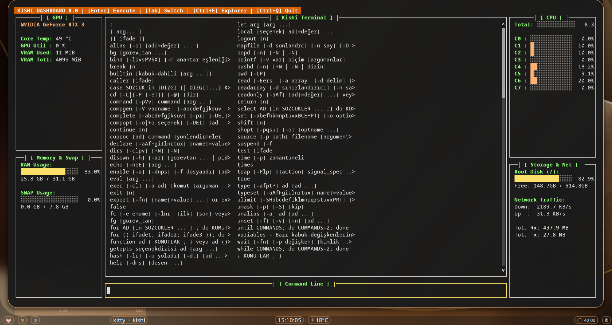

### 3-) Bağımsız Dosya Gezgini
IDE Explorer, dashboard dışında bağımsız bir çift panelli dosya tarayıcısı olarak da çalışır. Tüm dosya sisteminizde gezinin, dizinleri önizleyin ve satır numaralı editörle kod düzenleyin.
- **Komut:** `explore`
- **Kısayol:** **`Ctrl + E`**
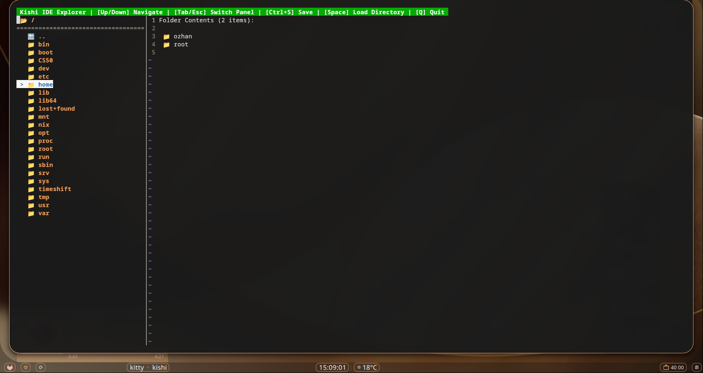
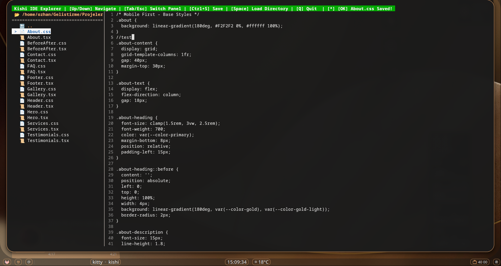

### 4-) Tab Completion & Sözdizimi Renklendirme
Kishi, sistem komutları, yerleşik komutlar ve dosya yolları için gerçek zamanlı tab completion sunar. Bilinen komutlar yeşil, bilinmeyenler kırmızı görünür.
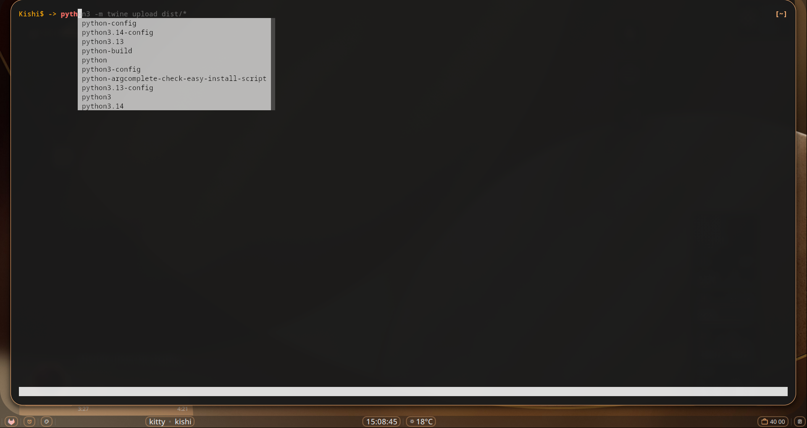

### 5-) Yardım Sistemi & Tarihçe Arama (Fuzzy Search)
- Kapsamlı Yardım İçin: `help` — Hızlı Kısayollar İçin: `help less`
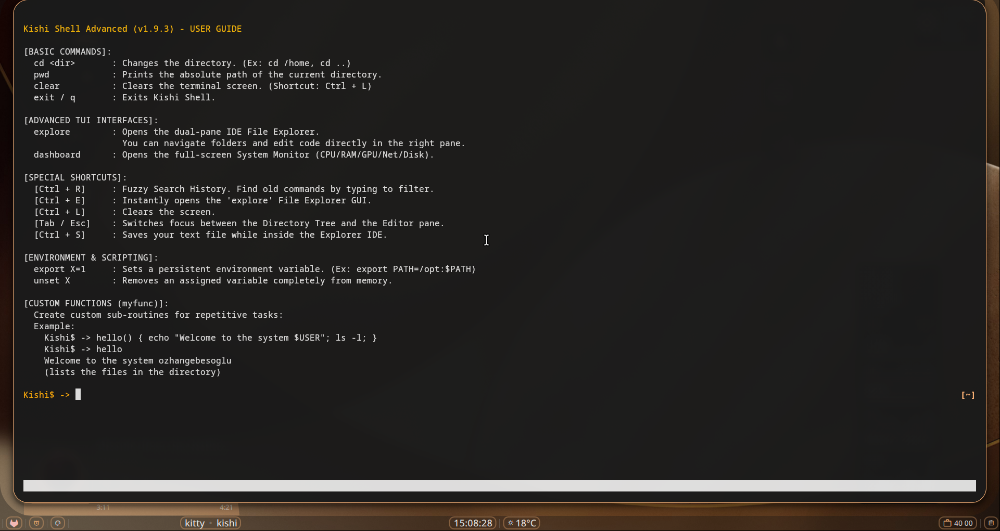
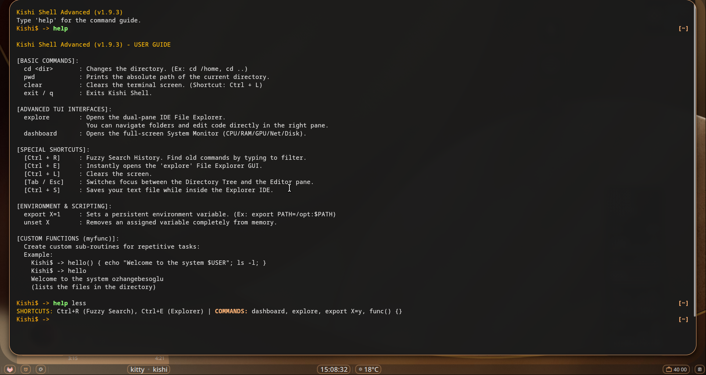

Eski komutlarınızı bulmak için harici FZF kurmanıza gerek yok.
- **Kısayol:** **`Ctrl + R`**
Daktilo gibi tuşlara bastıkça binlerce eski komutunuz arasından karakter eşleşmesi yaparak istediğiniz komutu saniyede ekranınıza getirir. `Enter`'a basıp komutu çekebilirsiniz.

---

##  Eklenti Pazaryeri (Marketplace)
Kishi Shell, Python gücüyle çalışan dinamik bir eklenti ekosistemine sahiptir. Terminalden hiç çıkmadan ve oturumu yeniden başlatmadan resmi eklentilere göz atabilir, kurabilir ve yönetebilirsiniz.

### Eklenti Komutları

| Komut | Açıklama |
|-------|----------|
| `plugin list` | Kurulu eklentileri listele |
| `plugin market` | Marketteki eklentilere göz at |
| `plugin install <isim>` | Marketten eklenti kur |
| `plugin install <url>` | Direkt GitHub raw URL'den eklenti kur |
| `plugin remove <isim>` | Eklentiyi kaldır |

### Mevcut Eklentiler

| Eklenti | Komut | Açıklama | Kullanım |
|---------|-------|----------|----------|
| **weather** | `weather` | [wttr.in](https://wttr.in) üzerinden canlı hava durumu | `weather` (otomatik konum) veya `weather Istanbul` |
| **ip** | `ip` | [ipinfo.io](https://ipinfo.io) üzerinden genel IP ve konum bilgisi | `ip` |
| **qr** | `qr` | Terminalde ASCII QR kod oluştur | `qr https://github.com` veya `qr "Merhaba"` |
| **hello** | `hello` | Demo eklenti — market bağlantınızı test edin | `hello` |

### Örnek Kullanım

```bash
# Markete göz at
Kishi$ -> plugin market
 Available Plugins in Kishi Marketplace:
  - hello.py
  - weather.py
  - ip.py
  - qr.py

# Eklenti kur
Kishi$ -> plugin install weather
[*] Downloading 'weather.py' from marketplace...
[+] Plugin 'weather' installed successfully!

# Hemen kullan — yeniden başlatmaya gerek yok
Kishi$ -> weather Istanbul
Istanbul: ⛅️ +18°C

# Kurulu eklentileri kontrol et
Kishi$ -> plugin list
 Installed Plugins:
  - weather

# Artık gerekmiyorsa kaldır
Kishi$ -> plugin remove weather
[+] Plugin 'weather' removed.
```

Eklentiler bir kez kurulduğunda normal komutlar kadar hızlı çalışır ve Kishi'nin olay döngüsüne entegre olur. Eklentiler `~/.kishi/plugins/` dizininde saklanır ve shell başlangıcında otomatik olarak yüklenir.

### Kendi Eklentinizi Oluşturma

Bir `.py` dosyası oluşturun — **dosya adı, dışa aktardığı komut adıyla birebir aynı olmalıdır:**

```python
# benikomutum.py
def benikomutum(args):
    """args[0] = komut adı, args[1:] = kullanıcı argümanları"""
    if len(args) < 2:
        print("Kullanım: benikomutum <metin>")
        return 1

    print(f"Merhaba, {args[1]}!")
    return 0  # çıkış kodu: 0 = başarılı

PLUGIN_COMMANDS = {
    "benikomutum": benikomutum  # anahtar dosya adıyla EŞLEŞMELİ (benikomutum.py -> "benikomutum")
}
```

Herhangi bir kaynaktan kurun:
```bash
# Resmi marketten (Kishi-Plugins reposuna PR gönderin)
plugin install benikomutum

# Veya herhangi bir raw GitHub URL'den
plugin install https://raw.githubusercontent.com/kullanici/repo/main/benikomutum.py
```

Daha fazla bilgi için [Kishi-Plugins](https://github.com/ozhangebesoglu/Kishi-Plugins) deposuna göz atın.

---

##  Scripting ve Çevre Değişkenleri (Environment)

### Değişken Atamak ve Okumak (`export`)
Kishi ortamına diğer programların da okuyabilmesi için yeni değişkenler tanımlayabilirsiniz.
```bash
Kishi$ -> export MY_KEY="12345"
Kishi$ -> echo $MY_KEY
12345
```
Silmek için `unset MY_KEY` yazmanız yeterlidir. Ortamda yüklü tüm değişkenleri sadece `export` yazarak listeleyebilirsiniz.

### Terminal İmlecini (Cursor) Özelleştirme
Terminal imlecini tüm TUI arayüzlerinde (Dashboard, Explorer vb.) küresel olarak değiştirmek için `CURSOR_SHAPE` değişkenini dışa aktarabilirsiniz. Bunu `~/.kishirc` dosyanıza ekleyin:
```bash
export CURSOR_SHAPE="BLINKING_BLOCK"
```
Mevcut seçenekler: `BLOCK`, `BLINKING_BLOCK`, `UNDERLINE`, `BLINKING_UNDERLINE`, `BEAM`, `BLINKING_BEAM`.

### Kendi Komutlarınızı Üretin (`myfunc`)
Bir işi sürekli tekrar ediyorsanız Kishi'ye anında kod blokları (Sub-Routines) öğretebilirsiniz. Fonksiyon tanımlamak çok kolaydır:

```bash
Kishi$ -> merhaba() { echo "Sisteme Hosgeldiniz $USER"; ls -l; }
Kishi$ -> merhaba
Sisteme Hosgeldiniz ozhangebesoglu
drwxrwxr-x 2 user user 4096 ...
```
Fonksiyonları ard arda noktalı virgül (`;`) ile zincirleyebilir, tek satırda devasa otomasyon scriptleri çalıştırabilirsiniz. Dahası, komutlarınızın ve çıktılarınızın ortasına `|`, `&&`, `>`, `>>` gibi karmaşık Shell operatörleri de sıkıştırabilirsiniz!

---

##  Mimari

Kishi, SOLID prensiplerine uygun klasik bir **derleyici hattı (compiler pipeline)** üzerine inşa edilmiştir:

```
Girdi → Lexer → Parser → Expander → Executor
          │        │         │          │
       token'lar   AST    genişletilmiş fork/exec
                           argümanlar   pipeline'lar
```

| Modül | Sorumluluk |
|-------|-----------|
| `lexer.py` | Tokenizasyon, tırnak takibi |
| `parser.py` | Recursive descent parser, AST oluşturma |
| `expander.py` | `$VAR`, glob, tilde, `$(cmd)` genişletme |
| `executor.py` | fork/exec, pipeline'lar, yönlendirmeler, iş kontrolü |
| `builtins.py` | 26 yerleşik komut |
| `tui_dashboard.py` | VS Code tarzı dashboard (5 SOLID sınıfı) |
| `tui_explorer.py` | Çift panelli IDE explorer |
| `tui_fuzzy.py` | Ctrl+R fuzzy arama motoru |
| `ui.py` | Sözdizimi vurgulama, tamamlama, kısayollar |
| `main.py` | Login shell, mod algılama, profile sourcing |
| `krep.py` | 3D semantik vektör arama motoru |
| `krep_learn.py` | PPMI + SVD modeli: sözlüksüz korpus öğrenme |
| `krep_core.pyx` | vectorize / cosine için Cython hızlandırma |
| `krep_cli.py` | Bağımsız `krep` CLI giriş noktası |

---

##  Krep AI — Semantik Arama (v2.0.2.0+)

Krep, **3D semantik vektör arama** aracıdır. `grep`'in aksine **anlamı**
yakalar: `"auth login"` aramasında `"password validated"`, `"token issued"`
veya `"yetkilendirme reddedildi"` gibi satırları da bulur.

Krep **hem** gömülü bir Kishi builtin'i **hem de** bağımsız bir CLI olarak
gelir. `pip install kishi-shell` PATH'inize iki binary ekler: `kishi` ve `krep`.

```bash
# Herhangi bir shell'den (bash, zsh, fish):
$ krep "auth login" /var/log/
$ krep --learn /var/log/ --auto-refresh 1h
$ cat app.log | krep error

# Kishi REPL içinden:
Kishi$ -> krep "auth login" /var/log/
```

### İki motor, otomatik dispatch

1. **Anahtar kelime motoru (varsayılan, sıfır setup):** 3 eksende (Hata /
   Güvenlik / Veri) 178 kelimelik dahili sözlük. Kutudan çıkar çıkmaz çalışır.
2. **LSA modeli (`krep --learn PATH`):** Korpustan PPMI + SVD ile eğitilmiş.
   Sözlük, eksenler, kelime vektörleri **gerçek dosyalardan** otomatik
   öğrenilir — manuel kelime listesi yok. Yapısı gereği çok dilli.
   **Opsiyonel extra gerektirir:** `pip install kishi-shell[krep]`
   (numpy + scipy ekler).

`krep --learn /var/log/` çağırdığında Krep:
- Tüm binary olmayan dosyaları tarar, tokenize eder (Unicode-aware)
- Sparse cooccurrence matrisi kurar
- PPMI (Positive Pointwise Mutual Information) ile normalize eder
- SVD rank-50 ile HD word embeddings hesaplar (cosine ranking için)
- PCA-3'e düşürür (yalnızca ASCII scatter görseli için)
- Her ekseni top-5 temsilci kelime ile otomatik etiketler
- `~/.cache/kishi/krep_models/<path-hash>/` altına kaydeder

```bash
$ krep --learn /var/log/ --auto-refresh 1h
[krep --learn] Vocab: 12,438 terms, 891,234 lines
[krep --learn] SVD rank-50 + PCA-3 (var=17.3%), 2.1s
[krep --learn] Axis 0: error fail timeout exception denied
[krep --learn] Axis 1: auth login user session token
[krep --learn] Axis 2: file query select read write
[+] Model saved: ~/.cache/kishi/krep_models/var_log_a8f3.../
    12438 terms, 891234 lines, 2.1s · auto-refresh 1h
```

### Tail-aware incremental güncelleme

Log dosyaları append-only'dir. Krep her dosyanın son okunan byte offset'ini,
mtime'ını ve boyutunu izler. `krep --update-learn` çağrıldığında yalnızca
**yeni satırlar** işlenir:

```bash
$ krep --update-learn /var/log/        # sadece tail, build süresinin ~%5'i
$ krep --list-models                   # cache'deki modelleri gör
$ krep --purge-models                  # hepsini sil
```

Rotation/truncate otomatik tespit edilir: dosya boyutu küçülürse baştan okunur.

### Lazy auto-refresh (daemon yok, cron yok)

`--auto-refresh INTERVAL` modele bir tazelik eşiği yazar. Her sorguda model
eşikten eskiyse Krep **background subprocess** ile yeniler (fire-and-forget).
Mevcut sorgu eski modelle devam eder; sıradaki sorgu yeniyi görür.

```bash
$ krep --learn /var/log/ --auto-refresh 1h
$ krep "auth failure" /var/log/         # 5 saat sonra
  # ↓ Background'da refresh tetiklenir
  # ↓ Bu sorgu eski modeli kullanır (hızlı)
$ krep "auth failure" /var/log/         # 3 saniye sonra
  # ↓ Yeni model otomatik yüklenir (cache mtime-invalidated)
```

İnterval'ler insancıl: `1h`, `30m`, `1d`, `2w`, `45s`, ya da kapatmak için `0`.

### ripgrep yüklüyse 200-3000× hızlanma

PATH'inizde `rg` (ripgrep) varsa Krep onu otomatik **streaming prefilter**
olarak kullanır: yalnızca eşleşen satırlar vektörleştirilir, gerisi atlanır.
`limit × 10` eşleşmeden sonra erken sonlandırma. Şu durumlarda yerleşik
Python motoruna düşer:
- `rg` yüklü değil,
- stdin pipe modu,
- `rg` 0 eşleşme dönerse (semantic neighbor için walker gerek).

```bash
$ krep --no-rg "auth login" /var/log/   # saf Python motorunu zorla
```

Doğrulanmış benchmark'lar (3-run avg, 12-core x86_64):

| Korpus | Sorgu | Walker | rg-streaming | Hızlanma |
|--------|-------|------:|-------------:|---------:|
| Kishi repo (~5k satır)      | `auth login`     | 1068 ms | **5 ms** | 206× |
| Python stdlib (~6.8M satır) | `auth login`     | timeout | **11 ms** | >5000× |
| Python stdlib               | `database query` | timeout | **14 ms** | >4000× |
| 1 GB tek dosya (17M satır)  | `auth login`     | timeout | **6 ms**  | >10000× |

---

##  Krep Performansı (v2.0.1.1+)

Krep AI, `krep` builtin'i için iki yollu arama mimarisi kullanır:

1. **ripgrep-streaming (rg yüklüyse varsayılan):**
   - Sorgudan word-only regex üretir (`auth login` → `auth|login`).
   - `rg -i -n --max-count=20` streaming subprocess'i çalıştırır.
   - stdout'u satır satır okur, her eşleşmeyi vektörleştirir, cosine benzerliği hesaplar.
   - `limit × 10` eşleşme bulunca `rg`'yi erken sonlandırır.
   - **Sonuç: sequential walker'a göre 100-3000x daha hızlı.**

2. **Yerleşik Python motoru (semantik fallback):** mtime-keyed in-memory
   concept-vector cache + satır seviyesinde bigram vektörleştirme. Şu durumlarda devreye girer:
   - ripgrep yüklü değil,
   - girdi stdin,
   - rg'nin literal pass'i 0 eşleşme döndü ama kullanıcının sorgusunun
     korpusta semantik komşusu var (örn. `login authorization` →
     `auth token expired` satırını eşler).

Override:
```bash
krep --no-rg PATTERN YOL    # Python motorunu zorla (debug/test)
```

Doğrulanmış benchmark'lar (3 koşu ortalaması, 12-core x86_64, Python 3.14, ripgrep 15.1):
| Korpus | Sorgu | Walker | rg-streaming | Hızlanma |
|--------|-------|------:|-------------:|---------:|
| Kishi repo (~5k satır)     | `auth login`     | 1068 ms | **5 ms** | 206x |
| Kishi repo                 | `error timeout`  | 1103 ms | **7 ms** | 156x |
| Kishi repo                 | `database query` | 1071 ms | **5 ms** | 210x |
| Tests klasörü (~3k satır)  | `auth login`     | 1053 ms | **6 ms** | 171x |
| Python stdlib (~6.8M satır)| `auth login`     | timeout (>60 s) | **11 ms** | >5000x |
| Python stdlib              | `error timeout`  | timeout | **9 ms**  | >6000x |
| Python stdlib              | `database query` | timeout | **14 ms** | >4000x |

---

##  Yardım Merkezi (`help`)
Kishi her zaman size asistanlık yapar. Sisteme ait tüm özellikleri ve komut ipuçlarını hatırlamak isterseniz:
- Kapsamlı (Tam) Yardım İçin: `help`
- Hızlıca Kısayol Özetleri İçin: `help less`
yazmanız yeterli olacaktır.

---

## Katkıda Bulunun

Katkılarınızı bekliyoruz! Başlamak için [CONTRIBUTING.md](CONTRIBUTING.md) dosyasına göz atın.

---
**Geliştiren:** Ozhan Gebesoglu  
*Python'un sınırlarını Terminal'de zorlamak için tasarlandı.*

## Star History

[](https://star-history.com/#ozhangebesoglu/Kishi-Shell&Date)
